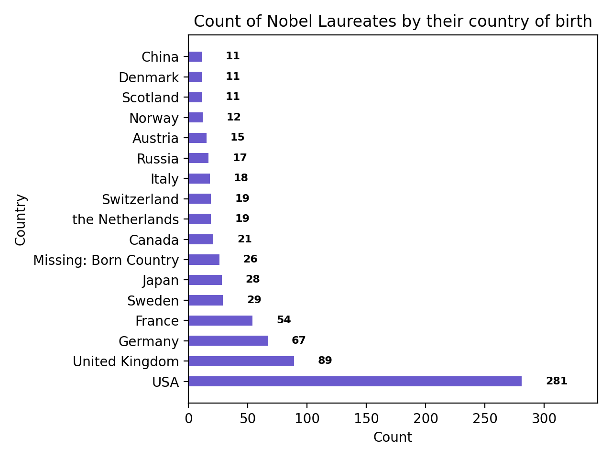

# Data Visualizations
These data visualizations were created as homework for my CS40 class. I hope you enjoy!

---
## Nobel Laureates by their Country of Birth

In this graph, I looked at which countries had the highest count of Nobel Laureates. The x axis is the number of Laureates and the y axis is the country where they were born. This data is sourced from [this website](http://api.nobelprize.org/v1/laureate.json).

---
## Crimes in the World per 100,000 people

This graph shows crimes in the world per 100,000 people. Here, I've plotted data for thefts and sexual assaults from 2003-2016. The data is sourced from [here](http://data.un.org/_Docs/SYB/CSV/SYB63_328_202009_Intentional%20Homicides%20and%20Other%20Crimes.csv).

---
Here is a link to the [project instructions](https://github.com/mikeizbicki/cmc-csci040/tree/2021fall/hw_02)